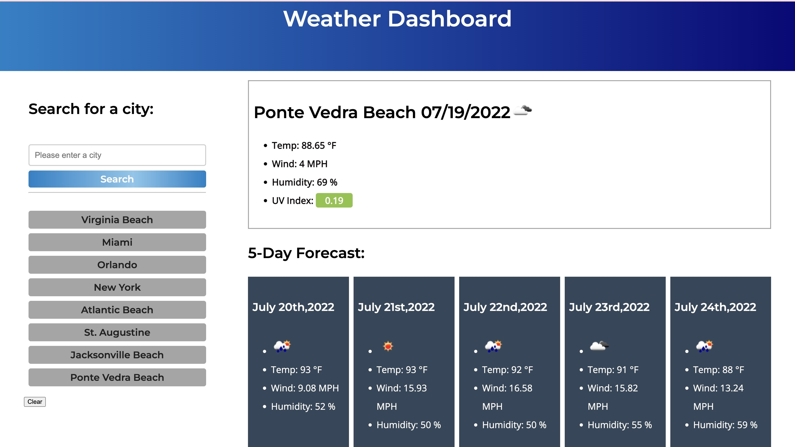

# Weather Dashboard

## Table of contents
* General info
* Technologies
* Screenshot
* Credits
* License

## General info
This project is a weather dashboard app with search functionality to find current weather conditions and forecasted weather for multiple cities. It uses the OpenWeather API to retrieve data for the cities, it features  dynamically updated HTML and CSS powered by jQuery, and displays a search history which the user can click to access past cities searched via local storage and clear the search history.  THis app took me some time to build.  I had issues with some to the code not working in my JS file.  Most of the issues were were typos.  The first error that had me was my key did not copy properly and it had an invalid key I did have to fix my fetch file, it was throwing a 401 error and I had to do some research to figure what happened.  It turned out to be I did not have the element set correctly.  

## Technologies
This project is created with:

Bootstrap 4
CSS
Font Awesome
HTML:5
JavaScript
jQuery
Moment.js
Open Weather API

## Screenshot
Project screenshot Link to my deployed github page: https://libhartll.github.io/WeatherDashboard06/

## Credits
I consulted the following resources:
Https://openweathermap.org/api
https://www.tutorialsteacher.com/jquery/jquery-ajax-method
https://learnwithparam.com/blog/how-to-handle-fetch-errors/
https://www.w3schools.com/charsets/ref_utf_letterlike.asp
https://stackoverflow.com/questions/60651524/clear-content-with-button
https://momentjs.com/docs/#/use-it/
https://www.javascripttutorial.net/javascript-dom/javascript-setattribute/
https://www.spatialtimes.com/2019/01/Create-a-JavaScript-Weather-App-with-Location-Data-Part-1/
https://stackoverflow.com/questions/32022699/how-to-use-openweathermap-api-for-javascript
https://javascript.plainenglish.io/display-7-day-weather-forecast-with-openweather-api-aac8ba21c9e3
https://javascript.tutorialink.com/openweather-api-using-javascript-fetch-with-user-input-keeps-previous-data-in-html-page/
https://gabrieleromanato.name/javascript-how-to-use-the-open-weather-map-api

### License

Copyright (c) [2022] [Lindsay Libhart]

Permission is hereby granted, free of charge, to any person obtaining a copy of this software and associated documentation files (the "Software"), to deal in the Software without restriction, including without limitation the rights to use, copy, modify, merge, publish, distribute, sublicense, and/or sell copies of the Software, and to permit persons to whom the Software is furnished to do so, subject to the following conditions:

The above copyright notice and this permission notice shall be included in all copies or substantial portions of the Software.

THE SOFTWARE IS PROVIDED "AS IS", WITHOUT WARRANTY OF ANY KIND, EXPRESS OR IMPLIED, INCLUDING BUT NOT LIMITED TO THE WARRANTIES OF MERCHANTABILITY, FITNESS FOR A PARTICULAR PURPOSE AND NONINFRINGEMENT. IN NO EVENT SHALL THE AUTHORS OR COPYRIGHT HOLDERS BE LIABLE FOR ANY CLAIM, DAMAGES OR OTHER LIABILITY, WHETHER IN AN ACTION OF CONTRACT, TORT OR OTHERWISE, ARISING FROM, OUT OF OR IN CONNECTION WITH THE SOFTWARE OR THE USE OR OTHER DEALINGS IN THE SOFTWARE.

#### Footer
Lindsay L. Libhart
Libhartinc@gmail.com
GitHub Challenge 06 Repository: WeatherDashboard06
https://github.com/LibhartLL/WeatherDashboard06
GitHub Repository for Lindsay L. Libhart
https://github.com/LibhartLL

